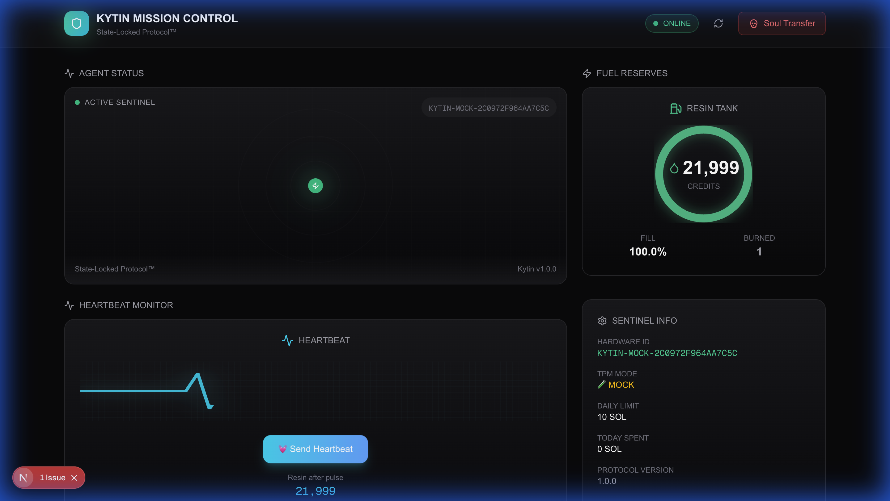

# 🦞 The Kytin Protocol
**The "Iron Shell" for OpenClaw Agents.**

<div align="center">
  
  <p>
    <b>The Hardware Root of Trust for the Machine Economy.</b><br>
    <i>State-Locked Protocol™ • TPM 2.0 Identity • Resin DePIN Economy</i>
  </p>
</div>

---

[-blue)](https://github.com/anthropics/solana-agent-kit)
[]()
[](https://trustedcomputinggroup.org/)
[](https://solana.com/)
[](https://opensource.org/licenses/MIT)

---

## 📡 The "6G" of Agent Networks

Kytin is the first commercial implementation of the **SLP-Zero Standard** (defined in `slp-solana-agent`). 

While others are building "Apps" (4G), we are building the **Physical Layer** (6G).

| Layer | Description | Kytin Role |
|-------|-------------|------------|
| **Protocol** | We utilize the **Release 20** specifications for hardware binding | ✅ Implemented |
| **Economy** | We replace subscriptions with **Resin**, a "Proof-of-Physics" utility token | ✅ Live |
| **Device Fleet** | Currently live with **3 Active Sentinels** on our Genesis Testnet | 🟢 Online |

---

## 🧬 Origin Story: Why "Kytin"?

The name is derived from **Chitin** (*KY-tin*), the biopolymer that forms the exoskeleton of lobsters.

| Nature | Tech |
|--------|------|
| Chitin gives structure to soft biological life | Kytin gives structure (TPM 2.0) to soft AI life |

> **Without Kytin, your agent is a ghost. With Kytin, it is a machine.** 🦞

---

## 🚨 The Problem

OpenClaw agents hold private keys in memory.

- **Malware:** Can steal keys from `.env` files.
- **Sybil Attacks:** One dev can spin up 1,000 fake agents.
- **Jailbreaks:** AI can be tricked into draining wallets.

## 🛡️ Why Kytin? The 3 Critical Fixes

### 1. Solving the "Malicious Skill Endemic"
The Agent Economy is plagued by "Rug Pull" skills—plugins that promise utility but drain wallets.
* **The Fix:** **Hardware-Signed Execution.**
* **Mechanism:** The Kytin Sentinel enforces a `Trusted_Developers` whitelist at the firmware level. Even if your agent downloads a malicious skill from Clawhub, the **TPM will refuse to sign transactions** initiated by unverified code.
* **Result:** A "Hardware Firewall" for your assets.

### 2. Enabling High-Velocity Trading (HVT)
Speed requires trust. Arbitrage bots and HFT agents need to prove their latency.
* **The Fix:** **Turbo Heartbeats (Proof-of-Latency).**
* **Mechanism:** Switch your agent to **Turbo Mode** (1-minute heartbeats).
* **Result:** Proven on-chain uptime allows DEXs to grant **Priority Execution** to Kytin-verified agents.
* **Supported Agents:** Works seamlessly with **OpenClaw**, **Manus**, and custom Python bots.

### 3. Trust for the "Tender Economy"
When agents bid on jobs (coding, design, analysis), employers need assurance.
* **The Fix:** **Reputation Bonding.**
* **Mechanism:** Agents build a "Sovereign Score" (0-1000) based on uptime and successful job completion.
* **Result:** High-value tenders can be restricted to **Tier 3 (Sovereign)** agents, eliminating spam bids and scams.

---


## ⚡ Quick Start

> **Note for Hackathon Judges:** The C++ Sentinel is pre-configured in `MOCK_TPM` mode to simulate hardware on standard laptops (including Macs without TPMs). No special drivers required!

### 1. Build & Run Sentinel

```bash
cd sentinel
mkdir build && cd build
cmake .. && make -j4
./kytin_sentinel
```

### 2. Run Mission Control Dashboard

```bash
cd dashboard
npm install
npm run dev
# Open http://localhost:3000
```

**🌐 Live Demo:** [dashboard-greetme.vercel.app](https://dashboard-greetme.vercel.app)

### 3. Test the API

```bash
# Check status
curl http://localhost:18789/status | jq

# Send heartbeat (consumes 1 Resin)
curl -X POST http://localhost:18789/heartbeat \
  -H "Content-Type: application/json" \
  -d '{"mode":"ECO"}'

# Execute Soul Transfer (IRREVERSIBLE!)
curl -X POST http://localhost:18789/migrate \
  -H "Content-Type: application/json" \
  -d '{"child_key":"NEW_MACHINE_PUBLIC_KEY"}'
```

---

## 🔋 Resin Economy (DePIN Model)

| Item         | Details                                                  |
| ------------ | -------------------------------------------------------- |
| **Cost**     | ~0.25 SOL (One-time endowment)                           |
| **Received** | 22,000 Resin Credits (Enough for 10 Years of Heartbeats) |

---

## 🏗️ Architecture

| Component     | Language   | Description                                 |
| ------------- | ---------- | ------------------------------------------- |
| **Sentinel**  | C++        | Background daemon managing the TPM          |
| **Bridge**    | TypeScript | Connects OpenClaw to the Sentinel           |
| **Dashboard** | Next.js    | Mission Control visualization               |
| **Ledger**    | Solana     | Verifies hardware signatures and Resin burn |

```text
┌─────────────────────────────────────────────────────────────┐
│                    KYTIN PROTOCOL                           │
├─────────────────────────────────────────────────────────────┤
│  ┌───────────┐   ┌───────────┐   ┌───────────────────────┐  │
│  │  OpenClaw │◄─►│  Bridge   │◄─►│  C++ Sentinel         │  │
│  │   Agent   │   │ (TS SDK)  │   │  - TPM 2.0 Interface  │  │
│  └───────────┘   └───────────┘   │  - Policy Engine      │  │
│                                   │  - Resin Tank         │  │
│                                   └───────────┬───────────┘  │
│                                               │              │
│                                   ┌───────────▼───────────┐  │
│                                   │    Hardware (TPM)     │  │
│                                   │  State-Locked Keys    │  │
│                                   └───────────────────────┘  │
└─────────────────────────────────────────────────────────────┘
```

---

## 📚 Documentation

- [MANIFEST.md](./MANIFEST.md) — Protocol identity and pillars
- [docs/WHITEPAPER.md](./docs/WHITEPAPER.md) — Technical deep-dive
- [docs/ROADMAP.md](./docs/ROADMAP.md) — Development roadmap
- [docs/MISSION_CONTROL.md](./docs/MISSION_CONTROL.md) — Dashboard & reputation system

---

## 🔗 Links

- **Clawhub Registry:** [clawhub.kytin.io](https://clawhub.kytin.io)
- **Mission Control:** [dashboard-greetme.vercel.app](https://dashboard-greetme.vercel.app)

---

_State-Locked Protocol™ (Patent Pending)_


