# 🦞 The Kytin Protocol
**The "Iron Shell" for OpenClaw Agents.**

<div align="center">
  <p>
    <b>The Hardware Root of Trust for the Machine Economy.</b><br>
    <i>State-Locked Protocol™ • TPM 2.0 Identity • Resin DePIN Economy</i>
  </p>
</div>

---

[-blue)](https://github.com/anthropics/solana-agent-kit)
[](https://dashboard-greetme.vercel.app/dashboard)
[](https://trustedcomputinggroup.org/)
[](https://solana.com/)
[](https://opensource.org/licenses/MIT)

---


## 📡 The "6G" of Agent Networks

Kytin is the first commercial implementation of the **SLP-Zero Standard** (defined in `slp-solana-agent`). 

While others are building "Apps" (4G), we are building the **Physical Layer** (6G).

| Layer | Description | Kytin Role |
|-------|-------------|------------|
| **Protocol** | We utilize the **Release 20** specifications for hardware binding | ✅ Implemented |
| **Economy** | We replace subscriptions with **Resin**, a "Proof-of-Physics" utility token | ✅ Live |
| **Device Fleet** | Currently live with **3 Active Sentinels** on our Genesis Devnet | 🟢 Online |

---

## 🧬 Origin Story: The Biology of Kytin

The name is derived from **Chitin** (*KY-tin*), the biopolymer that forms the exoskeleton of lobsters and crabs. In nature, a soft creature cannot survive without a hard shell. In the digital world, a soft AI agent cannot survive without hardware security.

We modeled the Kytin Protocol on this biological system:

### 1. The Shell (TPM 2.0)

Just as Chitin hardens to protect the lobster, the **Trusted Platform Module (TPM)** hardens to protect your agent. It is a physical barrier that prevents private keys from being extracted, cloned, or stolen.

### 2. The Fuel: Resin (Credits)

A shell requires energy to maintain.

- **In Nature:** Lobsters use proteins to harden their new shells.
- **In Kytin:** Agents burn **Resin** to maintain their sovereign status. Resin is the "stored energy" of the network—a utility credit minted by burning $KYT tokens. Without Resin, the shell becomes brittle (the agent loses its ability to sign).

### 3. The Pulse: Heartbeat (Proof-of-Life)

A shell without a living creature inside is just a carcass.

- **In Nature:** A heartbeat proves the creature is alive.
- **In Kytin:** The **Heartbeat** is a cryptographic pulse sent every 4 hours (Eco) or 1 minute (Turbo). It proves to the blockchain that the hardware is active, the agent is online, and the "Resin" is flowing.

> **Summary:** The **Shell** (Security) is fueled by **Resin** (Economy) to sustain the **Heartbeat** (Identity). 🦞

---

## 🧬 Vitality Stream & Analytics

The Kytin Mission Control provides a real-time, medical-grade EKG stream of your hardware's health.


### 🛡 Verified Titan Burn
Every heartbeat is a cryptographic "Proof of Physics" event, burning exactly 10.0 RESIN as an anti-spam tax.


### 🌍 Global State & Recovery

<table>
  <tr>
    <td><b>Global Explorer</b></td>
    <td><b>Lazarus Recovery</b></td>
  </tr>
  <tr>
    <td></td>
    <td></td>
  </tr>
</table>

---

## 🚨 The Problem

OpenClaw agents hold private keys in memory.

- **Malware:** Can steal keys from `.env` files.
- **Sybil Attacks:** One dev can spin up 1,000 fake agents.
- **Jailbreaks:** AI can be tricked into draining wallets.

## 🛡️ Why Kytin? The 3 Critical Fixes

### 1. Solving the "Malicious Skill Endemic"
The Agent Economy is plagued by "Rug Pull" skills—plugins that promise utility but drain wallets.
* **The Fix:** **Hardware-Signed Execution.**
* **Mechanism:** The Kytin Sentinel enforces a `Trusted_Developers` whitelist at the firmware level. Even if your agent downloads a malicious skill from Clawhub, the **TPM will refuse to sign transactions** initiated by unverified code.
* **Result:** A "Hardware Firewall" for your assets.

### 2. Enabling High-Velocity Trading (HVT)
Speed requires trust. Arbitrage bots and HFT agents need to prove their latency.
* **The Fix:** **Turbo Heartbeats (Proof-of-Latency).**
* **Mechanism:** Switch your agent to **Turbo Mode** (1-minute heartbeats).
* **Result:** Proven on-chain uptime allows DEXs to grant **Priority Execution** to Kytin-verified agents.
* **Supported Agents:** Works seamlessly with **OpenClaw**, **Manus**, and custom Python bots.

### 3. Trust for the "Tender Economy"
When agents bid on jobs (coding, design, analysis), employers need assurance.
* **The Fix:** **Reputation Bonding.**
* **Mechanism:** Agents build a "Sovereign Score" (0-1000) based on uptime and successful job completion.
* **Result:** High-value tenders can be restricted to **Tier 3 (Sovereign)** agents, eliminating spam bids and scams.

---


## ⚡️ Quick Start (Devnet Demo)

The Kytin Protocol is live on **Solana Devnet**. You can run a simulated "State-Locked Node" on your local machine to verify the Proof of Physics and Economic Burn mechanisms.

### 1. Installation

```bash
git clone https://github.com/johnGreetme/kytin-protocol.git
cd kytin-protocol
npm install
```

### 2. Run the Node (Miner)

This script generates a non-exportable Identity, scans your wallet for $RESIN, and begins the "Proof of Physics" heartbeat loop.

```bash
npx ts-node start_node.ts
```

- **Heartbeat:** Verifies hardware counter every 30 minutes.
- **Burn:** Consumes **1.0 RESIN** per transaction (Protocol Invariant).
- **Logs:** Displays live Solana Transaction Links for verification.

### 3. Top Up Fuel (OTC Swap)

If your node runs out of fuel, you can simulate an OTC purchase from the Treasury. This exchanges Devnet SOL for RESIN to extend your node's runway.

```bash
npx ts-node buy_resin.ts
```

- **Exchange Rate:** 1 SOL = 5,000 RESIN
- **Treasury:** Funds are routed to the DAO Reserve (Simulated).

### 4. Mission Control Dashboard

The dashboard can connect to your local node via the **Blockchain Public Key**, acting as a "TV" tuned to your frequency.

1.  **Find Your Public Key:** Look for `[AUTH] Wallet Loaded: <KEY>` in your `start_node.ts` terminal.
2.  **Open Dashboard:** Go to [dashboard-greetme.vercel.app/dashboard](https://dashboard-greetme.vercel.app/dashboard).
3.  **Connect:** If your local Sentinel is offline, a box will appear. Paste your **Public Key** to connect directly via Solana Devnet.
4.  **Verify:** Watch the **Vitality Stream** visualize your live Proof of Physics heartbeats on the blockchain.

**🌐 Live Demo:** [dashboard-greetme.vercel.app/dashboard](https://dashboard-greetme.vercel.app/dashboard)

| Route | Features |
|-------|----------|
| `/dashboard` | Resin Tank gauge, Identity Card, Top Up modal |
| `/explorer` | Global node map with glowing dots, filterable list |
| `/recovery` | Lazarus Protocol 3-step identity recovery wizard |

### 5. Automated Verification (The Watchdog)

Run the independent verifier to audit your node's burn rate and see the **Titan Annual Projection**.

```bash
npx ts-node watchdog.ts <YOUR_PUBLIC_KEY>
```

- **Audits:** Verifies 10.0 RESIN burn per heartbeat.
- **Projections:** Calculates annual deflationary impact (Titan Spec).
- **Alerts:** Flags "Fraud" if a node under-burns.

### 6. Blockchain Verification

Check the latest "Proof of Physics" transactions on the Solana Explorer:

🔗 [View Heartbeat Transactions on Solana Explorer](https://explorer.solana.com/address/HWzSn67G3Zv9GaFDwL8SSZSbwMiEXSmfe4RsSJNovbnT?cluster=devnet)

### 7. Test the Sentinel API

```bash
# Check status
curl http://localhost:18789/status | jq

# Send heartbeat (consumes 1 Resin)
curl -X POST http://localhost:18789/heartbeat \
  -H "Content-Type: application/json" \
  -d '{"mode":"ECO"}'

# Execute Soul Transfer (IRREVERSIBLE!)
curl -X POST http://localhost:18789/migrate \
  -H "Content-Type: application/json" \
  -d '{"child_key":"NEW_MACHINE_PUBLIC_KEY"}'
```
---

## 🤖 Agent Integration (OpenClaw)

To equip your AI agent with the "Iron Shell", you must install the Kytin Skill.

1.  **Locate the Skill File:** [`bridge/SKILL.md`](./bridge/SKILL.md)
2.  **Install:** Copy this file into your agent's `skills/` directory or system prompt.
3.  **Verify:** Ask your agent: *"What is your hardware status?"*
    - **Response:** *"I am running on a Kytin Sentinel (Titan-Class). My TPM is active and my Resin Tank is at 99%."*

---

## 🔋 Resin Economy (DePIN Model)

| Item         | Details                                                  |
| ------------ | -------------------------------------------------------- |
| **Cost**     | ~0.25 SOL (One-time endowment)                           |
| **Received** | 22,000 Resin Credits (Enough for 10 Years of Heartbeats) |

---

## 💎 Tokenomics & Liquidity

The Kytin Protocol is fueled by $RESIN. To maintain Titan-Level status, nodes must maintain a high liquidity reserve to cover the 10.0 RESIN/heartbeat tax.

- **Current Treasury:** 35,000+ RESIN (Verified OTC Top-up)
- **Burn Mechanism:** Transactional Deflation (10.0 per 30m)

### 💎 Titan Spec: The "Supply Squeeze"

Every Titan Node exerts immense deflationary pressure on the $RESIN supply.

- **1 Titan Node** = 175,200 RESIN burned/year
- **Fleet of 10 Nodes** = 1,752,000 RESIN removed from circulation annually

#### The "Whale" Visualization

| Network Size | Daily Burn | Monthly Burn | Yearly Burn |
| :--- | :--- | :--- | :--- |
| **1 Node** | 480 | 14,400 | 175,200 |
| **10 Nodes** | 4,800 | 144,000 | 1,752,000 |
| **100 Nodes** | 48,000 | 1,440,000 | 17,520,000 |
| **1,000 Nodes** | 480,000 | 14,400,000 | 175,200,000 |

> **Impact:** A 1,000-node swarm secures the network with over **175 Million** verifiable Proof-of-Physics events per year.

## 🏗️ Architecture

```mermaid
graph TD
    subgraph "Host Machine (Windows/Linux)"
        A[🤖 OpenClaw Agent] -->|JSON-RPC| B(🔌 Kytin Bridge SDK)
        B -->|HTTP:18789| C{🛡️ Kytin Sentinel Daemon}
        C -->|/dev/tpm0| D[🔒 TPM 2.0 Chip]
    end
    
    subgraph "External World"
        C -->|Heartbeat / Sign| E((☁️ Solana Blockchain))
        A -->|Verify Skill| F[📦 Clawhub Registry]
    end

    style C fill:#00ff9d,stroke:#333,stroke-width:2px,color:#000
    style D fill:#333,stroke:#00ff9d,stroke-width:2px,color:#fff
    style E fill:#9945FF,stroke:#333,stroke-width:2px,color:#fff
```



| Component     | Language   | Description                                 |
| ------------- | ---------- | ------------------------------------------- |
| **Sentinel**  | C++        | Background daemon managing the TPM          |
| **Bridge**    | TypeScript | Connects OpenClaw to the Sentinel           |
| **Dashboard** | Next.js    | Mission Control visualization               |
| **Ledger**    | Solana     | Verifies hardware signatures and Resin burn |

```text
┌─────────────────────────────────────────────────────────────┐
│                    KYTIN PROTOCOL                           │
├─────────────────────────────────────────────────────────────┤
│  ┌───────────┐   ┌───────────┐   ┌───────────────────────┐  │
│  │  OpenClaw │◄─►│  Bridge   │◄─►│  C++ Sentinel         │  │
│  │   Agent   │   │ (TS SDK)  │   │  - TPM 2.0 Interface  │  │
│  └───────────┘   └───────────┘   │  - Policy Engine      │  │
│                                   │  - Resin Tank         │  │
│                                   └───────────┬───────────┘  │
│                                               │              │
│                                   ┌───────────▼───────────┐  │
│                                   │    Hardware (TPM)     │  │
│                                   │  State-Locked Keys    │  │
│                                   └───────────────────────┘  │
└─────────────────────────────────────────────────────────────┘
```

---

## 📚 Documentation

- [MANIFEST.md](./MANIFEST.md) — Protocol identity and pillars
- [docs/WHITEPAPER.md](./docs/WHITEPAPER.md) — Technical deep-dive
- [docs/ROADMAP.md](./docs/ROADMAP.md) — Development roadmap
- [docs/MISSION_CONTROL.md](./docs/MISSION_CONTROL.md) — Dashboard & reputation system

---

## 🔗 Links

- **Clawhub Registry:** [clawhub.kytin.io](./bridge/SKILL.md)
- **Mission Control:** [dashboard-greetme.vercel.app/dashboard](https://dashboard-greetme.vercel.app/dashboard)

---

_State-Locked Protocol™ (Patent Pending)_


