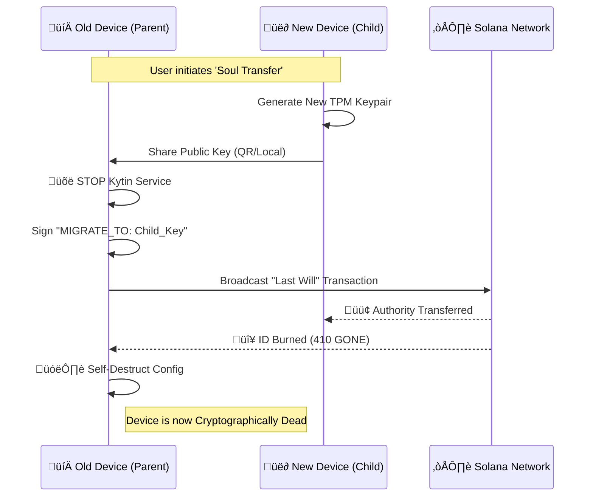

# Kytin: The State-Locked Protocol for Sovereign AI Agents

**Abstract**
As AI agents become economic actors, the "Sybil Problem" threatens the network. **Kytin** introduces the **State-Locked Protocol™ (SLP)**, a patent-pending mechanism that binds an agent's state to a specific Trusted Platform Module (TPM 2.0).

---

## 1. The Core Innovation: State-Locked Protocol™

SLP fuses three elements into a sovereign identity:

1.  **The Silicon Anchor:** A non-exportable key generated inside the TPM.
2.  **The Sovereign Policy:** Firmware-level rules (e.g., Daily Spend Limit) that cannot be bypassed by the OS.
3.  **The L1 Heartbeat:** A cryptographic proof of uptime settled on Solana.

---

## 2. The Resin Economy (Burn-and-Mint)

Kytin utilizes a **Dual-Token DePIN Model** to ensure sustainability.

### 2.1 The Governance Asset ($KYT)

| Property | Description |
|----------|-------------|
| **Role** | Value Capture & Voting |
| **Utility** | Staked for Tier 2/3 Status |
| **Deflation** | Protocol fees are used to **Buy Back and Burn $KYT** |

### 2.2 The Utility Fuel (Resin)

| Property | Description |
|----------|-------------|
| **Role** | Network Gas (Stable) |
| **Source** | Minted **only** by burning $KYT |

#### Consumption Rates

| Action | Resin Cost |
|--------|------------|
| **Eco Heartbeat (4h)** | 1 Resin |
| **Turbo Heartbeat (1m)** | 240 Resin (High Frequency Status) |
| **Skill Check** | 50 Resin per download |

---

## 3. Security Features

### 3.1 Malware Defense
The Sentinel verifies the signature of every Skill against a "Trusted Developer" whitelist before loading.

### 3.2 Soul Transfer Protocol

When upgrading hardware, the **Parent TPM** signs a "Last Will" transaction to authorize a **Child TPM**, burning a **0.05 SOL "Reincarnation Fee."**

#### The Migration Flow

> **⚠️ IRREVERSIBLE:** Once the "Last Will" is signed, the old device can NEVER sign transactions again. The TPM marks the key as expired.

### 3.6 The Lazarus Protocol (Disaster Recovery)

To mitigate hardware failure (e.g., motherboard destruction) where the TPM cannot sign a migration transaction, Kytin implements an Identity Abstraction Layer.

1.  **Corporate Personhood:** The Agent's identity is a stable Program Derived Address (PDA) on Solana. Contracts and assets are held by the PDA, not the transient TPM key.
2.  **Guardian Recovery:** The Agent designates an Owner Authority (e.g., a Ledger hardware wallet). In the event of catastrophic hardware failure, the Owner Authority can sign a `Force_Rotate_Key` instruction to appoint a new TPM.
3.  **Contract Continuity:** Since DeFi interactions and Service Agreements are bound to the PDA, a key rotation does not break existing contracts. The new hardware simply resumes the "CEO" role of the Agent entity.

---

*State-Locked Protocol™ is a patent-pending technology.*

---

## 4. Hardware Security FAQ

### Q: What is a side-channel attack, and why does it matter for AI agents?
**A:** Unlike traditional hacks that target mathematical weaknesses in code, a side-channel attack exploits physical information leaks from the hardware itself. Attackers may monitor power consumption, electromagnetic radiation, or even the precise time it takes for a chip to sign a transaction to deduce secret keys bit by bit. For an autonomous AI agent, a successful side-channel attack means its unique identity could be cloned, allowing an attacker to impersonate the "Shell".

### Q: How does the Kytin TPM 2.0 protect against these physical leaks?
**A:** The Kytin Protocol leverages **Discrete TPMs (dTPMs)**, which are dedicated, tamper-resistant semiconductor packages with higher physical security certification (e.g., FIPS-140 Level 3) than software-based alternatives.

- **Constant-Time Cryptography:** Kytin-compliant TPMs are designed to perform operations like signing heartbeats with secret-independent execution times, mitigating timing analysis.
- **Masking and Blinding:** The hardware applies internal "noise" or masking to its internal operations, ensuring that power usage patterns do not correlate directly with the secret keys.
- **Shielded Locations:** Keys exist only within Shielded Locations on the chip; they are never disclosed to the operating system, protecting them even if the agent's software environment is fully compromised.

### Q: Can a human "brute-force" the Kytin hardware?
**A:** No. TPM 2.0 includes anti-hammering protection designed specifically to prevent brute-force and dictionary attacks.

- **Lockout Logic:** If a local attacker attempts to authorize a key with incorrect values too many times, the TPM enters a global lockout state.
- **Time-Gated Recovery:** The TPM is configured to "forget" failures slowly (e.g., one failure every 10 minutes), making rapid-fire guessing mathematically impossible.

### Q: Is the Kytin "Shell" vulnerable to bus-sniffing?
**A:** Standard TPM communications over SPI/LPC buses can be vulnerable to signal "sniffing". To defend against this, Kytin recommends:

- **Parameter Encryption:** Enabling encrypted communication between the CPU and the TPM to prevent cleartext keys from being captured by logic analyzers.
- **Sealing with PCRs:** Binding (sealing) keys to specific hardware measurements (Platform Configuration Registers). If the system detects any unauthorized hardware changes, the TPM refuses to release the "Titan" signing keys.

